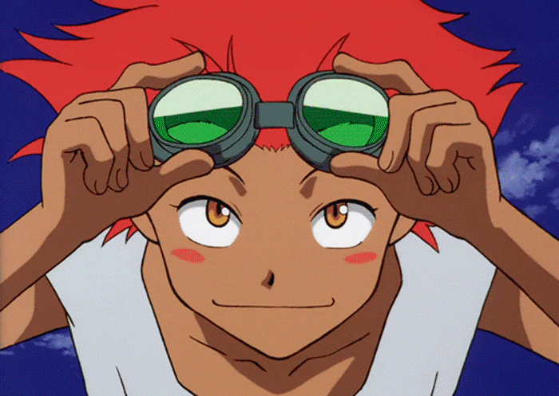

<h1 align="center">Lesson, lesson: if you see a stranger, follow him!</h1>

    Hi! I'm Chloe, and this is my secondary Github account 
    <em>manenbranta</em>.

I'm an aspiring programmer and game developer. I'm interested in linux, and occasionally do game modding.

<h2>Languages and Technologies I use!</h2>
<h4>Programming Languages</h4>

<h4>Other</h4>

 

<h2>Github Stats</h2>

    
    

